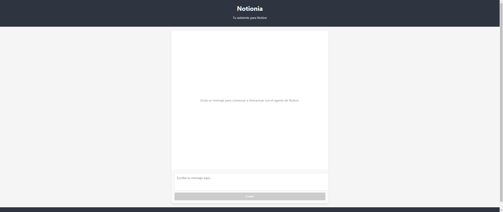
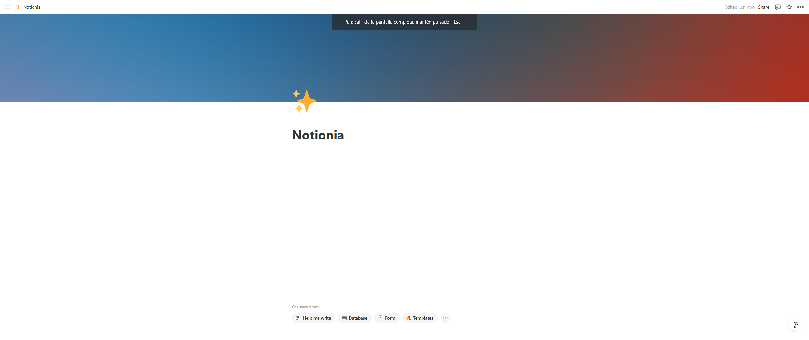
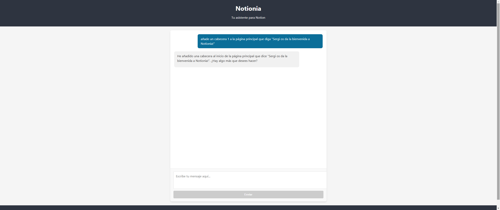
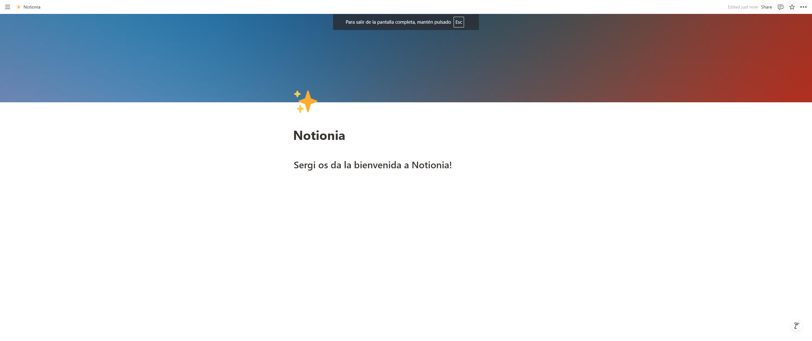
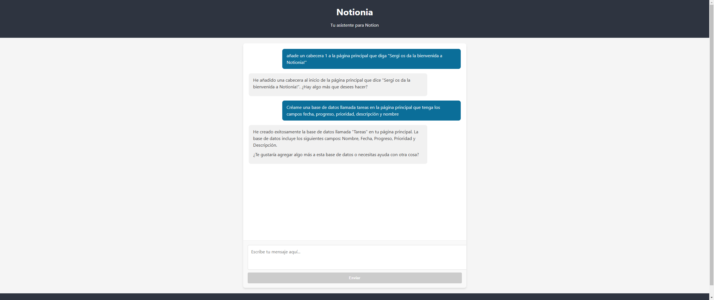
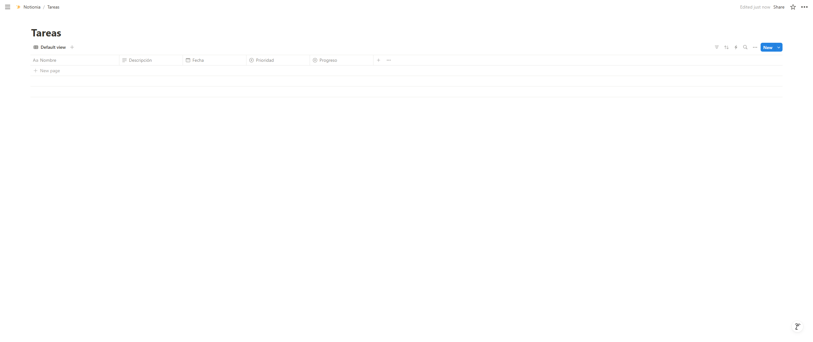

# Notionia

<p align="center">
  
</p>

## Capturas de pantalla

<details open>
  <summary><strong>Todas las capturas de pantalla</strong></summary>

  ### 1. Vista general
  <p align="center">
    
  </p>

  ### 2. Creación de páginas
  <p align="center">
    
  </p>

  ### 3. Gestión de bases de datos
  <p align="center">
    
  </p>

  ### 4. Navegación contextual
  <p align="center">
    
  </p>

  ### 5. Exploración recursiva
  <p align="center">
    
  </p>

  ### 6. Interfaz conversacional
  <p align="center">
    
  </p>
</details>

Notionia es una aplicación que te permite interactuar con un agente de Notion para gestionar tu espacio de trabajo de manera eficiente. Utiliza un agente de IA para interpretar tus solicitudes en lenguaje natural y realizar acciones en tu espacio de trabajo de Notion.

## Características

- **Gestión de páginas**: Crear, actualizar y navegar por páginas de Notion
- **Gestión de bases de datos**: Crear bases de datos con propiedades personalizadas
- **Navegación contextual**: El agente navega por tu espacio de trabajo sin necesidad de proporcionar IDs
- **Exploración recursiva**: Navega a través de bloques anidados para acceder a información detallada
- **Interfaz conversacional**: Interactúa con tu espacio de Notion a través de lenguaje natural

## Arquitectura

## Requisitos previos

- Python 3.11+
- Node.js 16+ y npm
- Token de API de Notion
- Clave de API de OpenAI
- ID de página padre en Notion donde el agente trabajará

## Estructura del Proyecto

```
notionia/
├── backend/               # Servidor backend con FastAPI
│   ├── src/
│   │   ├── agent/         # Implementación del agente de Notion
│   │   │   ├── notion_agent.py
│   │   │   └── system_prompt.yaml
│   │   ├── api/           # API REST
│   │   │   └── app.py
│   │   └── main.py        # Punto de entrada
│   ├── .env               # Variables de entorno (no incluido en el repo)
│   └── pyproject.toml     # Configuración del proyecto Python
├── frontend/              # Cliente web React
│   ├── public/
│   ├── src/
│   │   ├── components/
│   │   └── ...
│   ├── package.json
│   └── tsconfig.json
├── .vscode/               # Configuración de VSCode
│   └── settings.json
└── run.ps1                # Script para iniciar la aplicación en Windows
```

## Instalación

### 1. Clonar el repositorio

```bash
git clone https://github.com/tu-usuario/notionia.git
cd notionia
```

### 2. Configurar el Backend

1. Crear un entorno virtual e instalar dependencias:

```bash
cd backend
python -m venv .venv
# En Windows
.venv\Scripts\activate
# En macOS/Linux
source .venv/bin/activate

# Instalar dependencias
pip install -e .
```

2. Crear un archivo `.env` en la carpeta `backend` con las siguientes variables:

```
NOTION_TOKEN=tu_token_de_notion
PARENT_PAGE_ID=id_de_pagina_padre
OPENAI_API_KEY=tu_api_key_de_openai
```

Para obtener tu token de Notion:
- Ve a [https://www.notion.so/my-integrations](https://www.notion.so/my-integrations)
- Crea una nueva integración
- Copia el "Internal Integration Token"
- Asegúrate de compartir la página de Notion con tu integración

### 3. Configurar el Frontend

```bash
cd frontend
npm install
```

## Ejecución

### Método 1: Script de inicio (Windows)

Ejecuta el script `run.ps1` desde PowerShell para iniciar tanto el backend como el frontend:

```powershell
.\run.ps1
```

### Método 2: Inicio manual

#### Backend:

```bash
cd backend
# Activar el entorno virtual si no está activado
.venv\Scripts\activate  # Windows
source .venv/bin/activate  # macOS/Linux

# Iniciar el servidor
cd src
fastapi dev
```

El backend estará disponible en `http://localhost:8000`.

#### Frontend:

```bash
cd frontend
npm start
```

El frontend estará disponible en `http://localhost:3000`.

## Uso

1. Abre tu navegador en `http://localhost:3000`
2. Escribe una solicitud en lenguaje natural, como:
   - "Crea una nueva página llamada Proyecto X"
   - "Crea una base de datos para seguimiento de tareas"
   - "Muéstrame el contenido de mi página de Proyecto X"
3. El agente interpretará tu solicitud y realizará las acciones correspondientes en tu espacio de trabajo de Notion

## Documentación de la API

La documentación interactiva de la API está disponible en `http://localhost:8000/docs` cuando el servidor backend está en ejecución.

## Contribuir

Las contribuciones son bienvenidas. Por favor, sigue estos pasos:

1. Haz fork del repositorio
2. Crea una rama para tu característica (`git checkout -b feature/amazing-feature`)
3. Haz commit de tus cambios (`git commit -m 'Add some amazing feature'`)
4. Haz push a la rama (`git push origin feature/amazing-feature`)
5. Abre un Pull Request

## Licencia

Este proyecto está licenciado bajo la Licencia MIT - ver el archivo [LICENSE](LICENSE) para más detalles.
