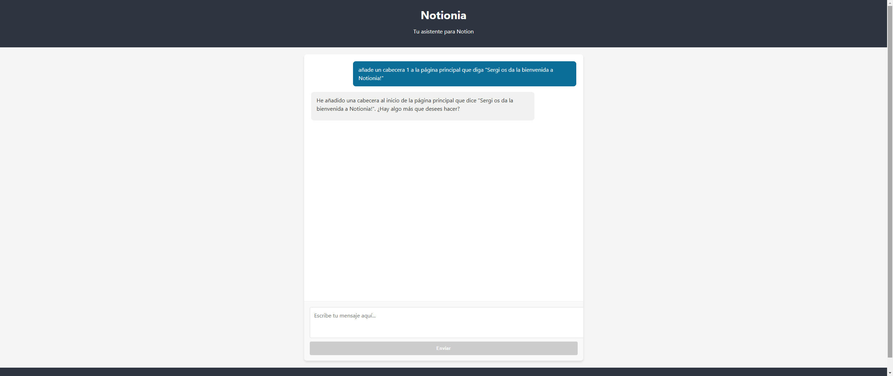

# Backend de Notionia

  

Este directorio contiene el código del backend de Notionia, que proporciona la API y la lógica del agente de Notion.

## Capturas de pantalla

Para ver todas las capturas de pantalla del proyecto, consulta el [README principal](../README.md).

Algunas capturas de pantalla relacionadas con el backend:

### Gestión de bases de datos

  

## Arquitectura

El backend está construido con FastAPI y se comunica con la API de Notion y OpenAI para proporcionar funcionalidades de gestión de espacios de trabajo de Notion mediante lenguaje natural.

## Licencia

Este proyecto está licenciado bajo la Licencia MIT - ver el archivo [LICENSE](../LICENSE) para más detalles.